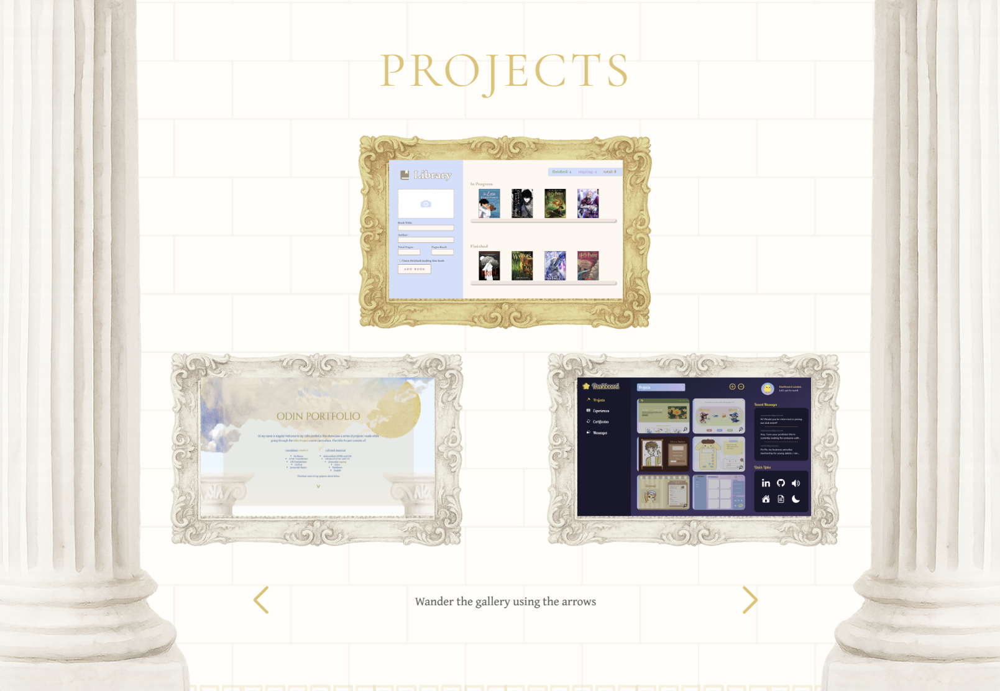

# 🏛️ Odin Project Portfolio  

An interactive portfolio designed as a **Greek-inspired art gallery**, where projects are displayed like framed paintings inside a digital museum. Built to showcase my work from **The Odin Project curriculum**, blending functionality with creative design.  

## ✨ What’s inside  
- A **gallery-inspired layout** with pillars, golden frames, and curated sections  
- Interactive **carousel navigation** (Swiper.js) to wander through projects  
- Hover and animation effects for a lively, immersive feel  
- Clear **project showcases** (Calculator, Rock-Paper-Scissors, Etch-a-Sketch, Library App, etc.)  
- Fully responsive design that adapts to different screen sizes  

## 🧰 Built with  
- HTML  
- CSS
- JavaScript  
- Swiper.js

## 🖼️ Preview  
  

## 🎧 Bonus  
- Guided text prompts
- Glowing cursors and subtle animation details for extra polish  
- Designed to feel like a **museum exhibit** of my early developer projects  
